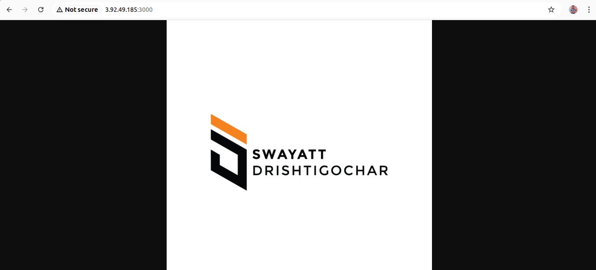
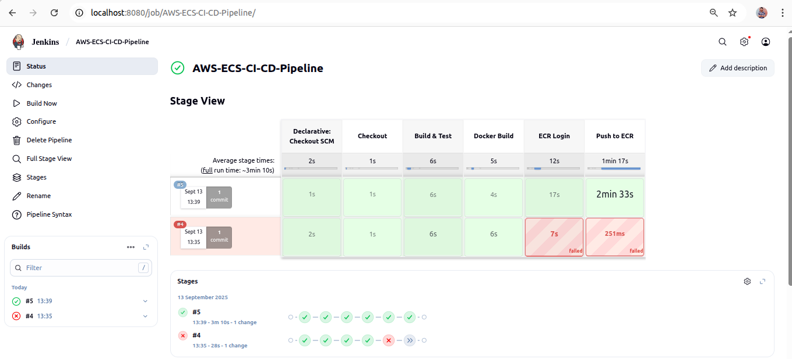
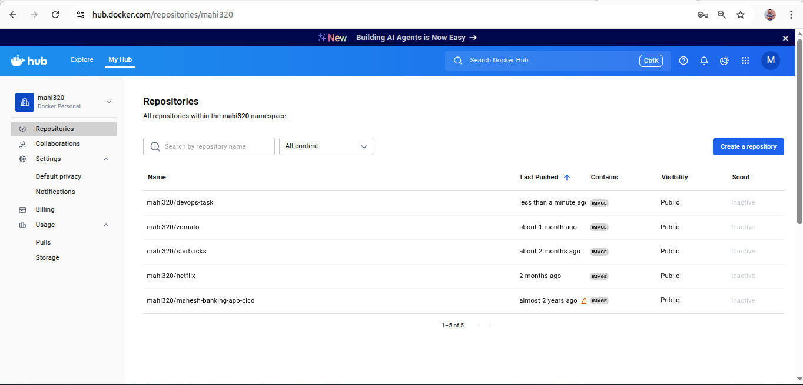
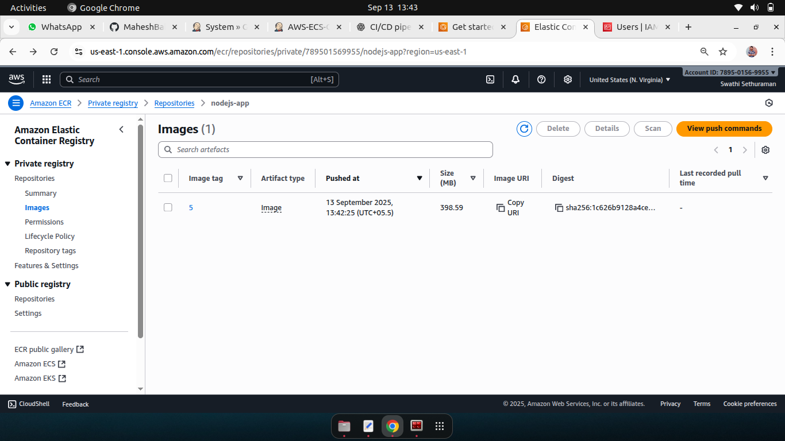
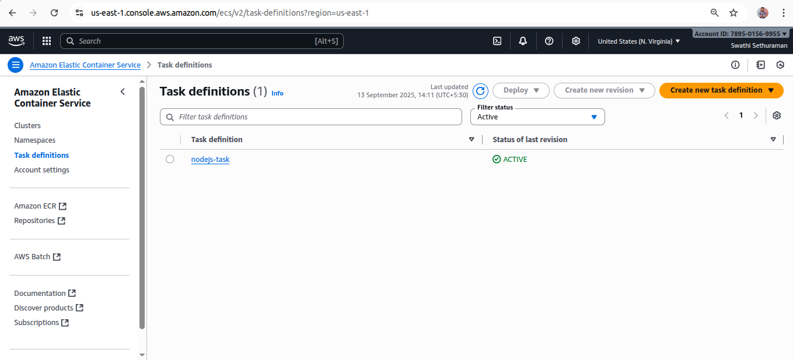

🚀 AWS-ECS-CI-CD-Pipeline-Project

This project sets up a complete CI/CD pipeline using Jenkins, Docker, AWS ECR, and AWS ECS to automate the build, test, containerization, and deployment of a Node.js application.

Source Control: Git + GitHub

CI/CD: Jenkins

Containerization: Docker

Image Registry: Amazon ECR

Container Orchestration: Amazon ECS (Fargate)

Monitoring & Logs: AWS CloudWatch

📁 Project Structure
devops-task/
├── app.js                  # Node.js application entry point
├── package.json            # Node.js dependencies
├── package-lock.json
├── Dockerfile              # Docker instructions to build app image
├── Jenkinsfile             # Jenkins pipeline script
├── README.md
├── deployment-proof/       # Screenshots or deployed URL proofs
└── docs/
    └── architecture.png    # Architecture Diagram

🧱 Architecture Overview
Developer
   |
   |  (Git Push)
   v
Git (Local) ───> GitHub (Remote Repo)
                      |
                      |  (Webhook Trigger)
                      v
                Jenkins (CI/CD)
                      |
        +-------------+-------------+
        |                           |
   Build & Test               Docker Build
        |                           |
        +-------------+-------------+
                      |
                Push Docker Image
                      v
              AWS ECR (Image Registry)
                      |
                      v
              AWS ECS (App Deployment)
                      |
                      v
          AWS CloudWatch (Logs & Metrics)

🧭 One-Line Flow

Developer → GitHub → Jenkins → Docker → ECR → ECS → CloudWatch

📌 Key Workflow

Developer pushes code to GitHub (dev branch)

GitHub Webhook triggers Jenkins job

Jenkins performs:

Git checkout

Dependency install & test

Docker image build

Push image to Amazon ECR

Deploy to Amazon ECS (Fargate)

Application runs inside ECS container

Logs and metrics stream to AWS CloudWatch

✅ Tooling Breakdown
🖥️ Local Tools

Git – Version control

Jenkins – CI/CD pipeline runner (self-hosted)

Node.js – Runtime for app build/test

Docker – Container builder

Terraform (optional) – Infrastructure provisioning

☁️ Cloud Services

GitHub – Source code hosting

Amazon ECR – Docker image registry

Amazon ECS (Fargate) – Container deployment

AWS CloudWatch – Logging & monitoring

#jenkins  cicd pipeline

##workflow
##🧱 PHASE 1: Setup Source Code & GitHub

#git
sudo apt install git
git --version

git clone git@github.com:SwayattDrishtigochar/devops-task.git
cd devops-task

##Create a new repository in github
echo "# AWS-ECS-CI-CD-Pipeline-Project" >> README.md
git init
git add README.md
git commit -m "first commit"
git branch -M main
git remote add origin git@github.com:MaheshBabu-DevOps/AWS-ECS-CI-CD-Pipeline-Project.git
git push -u origin main

git checkout -b dev
git push origin dev

###🧱 PHASE 2
#install docker
https://docs.docker.com/engine/install/ubuntu/

#🧱 PHASE 3
##✅Install Jenkins on Ubuntu (or EC2)

sudo wget -O /etc/apt/keyrings/jenkins-keyring.asc \
  https://pkg.jenkins.io/debian-stable/jenkins.io-2023.key
echo "deb [signed-by=/etc/apt/keyrings/jenkins-keyring.asc]" \
  https://pkg.jenkins.io/debian-stable binary/ | sudo tee \
  /etc/apt/sources.list.d/jenkins.list > /dev/null
sudo apt-get update
sudo apt-get install jenkins

sudo apt update
sudo apt install fontconfig openjdk-21-jre
java -version
openjdk version "21.0.3" 2024-04-16
OpenJDK Runtime Environment (build 21.0.3+11-Debian-2)
OpenJDK 64-Bit Server VM (build 21.0.3+11-Debian-2, mixed mode, sharing)

java  --version
jenkins --version

sudo systemctl enable jenkins
sudo systemctl start jenkins
sudo systemctl status jenkins

http://localhost:8080

sudo cat /var/lib/jenkins/secrets/initialAdminPassword

#plugins-setup
#Install plugins: Git, Docker, Pipeline, AWS Credentials

##credentials-setup
Manage Jenkins > Credentials > System > Global credentials

1. #github cred
Step 1: Add GitHub credentials in Jenkins

#username % password(token)

Go to Jenkins → Manage Jenkins → Credentials → System → Global credentials (unrestricted).

Click Add Credentials (left sidebar).

Fill the form:

Kind: Username with password

Username: MaheshBabu-DevOps

Password: Your Personal Access Token (paste the token you copied)

ID: github-https-creds (or any name you like)

Description: GitHub PAT for HTTPS repo access

Click OK to save.

2. #aws credentials

#create-IAM for ecs and ecr
✅ Step-by-Step: Create Access Key for Existing IAM User

Go to the AWS IAM Console:
👉 https://console.aws.amazon.com/iam

In the left sidebar, click:
Users → click on jenkins-ecr-user

Attach These Policies to the Group:

✅ Search and check these two AWS-managed policies:

AmazonEC2ContainerRegistryFullAccess

AmazonECS_FullAccess

Click the tab: Security credentials

Scroll to: Access keys

Click:
✅ “Create access key”

In the prompt:

Choose "Application running outside AWS"

Click Next

Add a description (optional): e.g. Jenkins ECR CI/CD

Click “Create access key”

✅ You will now see:

Access key ID (visible)

Secret access key (only shown once — download it now!)

Save the keys in a safe place (e.g. password manager or .env file locally for testing)
Go to Jenkins → Manage Jenkins → Credentials → System → Global credentials (unrestricted).
JENKINS
----------------------------------------------------------------------------------------
| Field                 | What to enter                                                |
| --------------------- | ------------------------------------------------------------ |
| **Kind**              | AWS Credentials                                              |
| **Scope**             | Global (default is fine)                                     |
| **ID**                | `aws-creds` (or any unique name you'll remember)             |
| **Access Key ID**     | `YOUR_ACCESS_KEY_ID`                                       |
| **Secret Access Key** | `YOUR_SECRET_ACCESS_KEY`                   |
| **Description**       | `AWS creds for Jenkins CI/CD`                                |
| **IAM Role Support**  | Leave unchecked unless you use IAM Roles with Jenkins agents |
----------------------------------------------------------------------------------------

#🧱 PHASE 4

#How to create an ECR repository--(Instead of DockerHub)
Option 1: Using AWS Console

Log in to AWS Management Console

Go to Elastic Container Registry service.

Click Create repository.

Enter a repository name, e.g., your-nodejs-app.

Choose other settings as default (or adjust if needed).

Click Create repository.

Note the Repository URI — you'll need this in your Jenkins pipeline.

#🧱 PHASE 5
##create a dockerfile & jenkinsfile locally and push into github

#sudo nano Dockerfile

FROM node:18

WORKDIR /app

COPY package*.json ./
RUN npm install

COPY . .

EXPOSE 3000
CMD ["node", "app.js"]

#sudo nano package.json
{
  "name": "logo-server",
  "version": "1.0.0",
  "main": "app.js",
  "scripts": {
    "start": "node app.js",
    "test": "echo \"No tests yet\" && exit 0"
  },
  "dependencies": {
    "express": "^4.18.2"
  }
}

#sudo nano jenkinsfile

pipeline {
    agent any  // Run this pipeline on any available Jenkins agent

    environment {
        AWS_REGION = 'us-east-1'  // AWS region where ECR repo is hosted
        ECR_REPO = '789501569955.dkr.ecr.us-east-1.amazonaws.com/nodejs-app'  // ECR repository URI
        IMAGE_TAG = "${env.BUILD_NUMBER}"  // Use Jenkins build number as Docker image tag

        // Inject AWS credentials stored in Jenkins credential manager
        AWS_ACCESS_KEY_ID = credentials('aws-creds')
        AWS_SECRET_ACCESS_KEY = credentials('aws-creds')
    }

    stages {
        stage('Checkout') {
            steps {
                // Clone the GitHub repository from the 'dev' branch using specified credentials
                git branch: 'dev', credentialsId: 'github-https-creds', url: 'https://github.com/MaheshBabu-DevOps/AWS-ECS-CI-CD-Pipeline-Project.git'
            }
        }

        stage('Build & Test') {
            steps {
                // Install npm dependencies
                sh 'npm install'
                // Run npm tests
                sh 'npm test'
            }
        }

        stage('Docker Build') {
            steps {
                // Build a Docker image tagging it with the ECR repo and the build number
                sh "docker build -t $ECR_REPO:$IMAGE_TAG ."
            }
        }

        stage('ECR Login') {
            steps {
                // Configure AWS CLI with the injected AWS credentials and region
                // Then retrieve a login token for ECR and login Docker client to the ECR repository
                sh '''
                    aws configure set aws_access_key_id $AWS_ACCESS_KEY_ID
                    aws configure set aws_secret_access_key $AWS_SECRET_ACCESS_KEY
                    aws configure set region $AWS_REGION

                    aws ecr get-login-password --region $AWS_REGION | docker login --username AWS --password-stdin $ECR_REPO
                '''
            }
        }

        stage('Push to ECR') {
            steps {
                // Push the Docker image to the specified ECR repository
                sh "docker push $ECR_REPO:$IMAGE_TAG"
            }
        }
    }
}

#install aws cli on local--(optional) 
https://docs.aws.amazon.com/cli/latest/userguide/getting-started-install.html
Install AWS CLI v2 on Ubuntu
sudo apt update

sudo apt install -y curl unzip
curl "https://awscli.amazonaws.com/awscli-exe-linux-x86_64.zip" -o "awscliv2.zip"
unzip awscliv2.zip
sudo ./aws/install

aws --version

#git-local
git add .
git commit -m "Your message"
git push origin dev

#⚙️ Jenkins Job Setup
1. Create a New Pipeline Job

Click New Item → Pipeline → Name: AWS-ECS-CI-CD-Pipeline-Project

Pipeline Definition: Pipeline script from SCM

SCM: Git

Repo URL: https://github.com/MaheshBabu-DevOps/devops-task.git

Branch: */dev

Script Path: Jenkinsfile

#🧪 Run Pipeline
Click Build Now

View Console Output

##once done pipeline  build after sucess

##verify
👉 AWS Console → ECR → Your Repository → Images
✔️ Make sure your image is there, e.g., nodejs-app:5

###🧱 PHASE 6
#🏗️ ✅ ECS Deployment — Step-by-Step Guide
ECS
cluster
task
IAM-ROLES-
service

#✅ STEP 1: Create ECS Cluster

Go to ECS Console → Clusters

Click Create Cluster

Choose: "Networking only" (Fargate)

Cluster Name: nodejs-cluster

Leave everything else default (it will create a new VPC, subnets, etc.)

Click Create

#✅ STEP 2: Create Task Definition

Go to ECS Console → Task Definitions → Create new

Choose: Fargate

Fill in:

Task Definition Name: nodejs-task

Task Role: ecsTaskExecutionRole

Requires compatibilities: FARGATE

CPU/Memory: 256 vCPU / 512 MiB (or higher if needed)

Scroll to Container Definitions:

Click Add container

Container name: nodejs-app

Image URI:
789501569955.dkr.ecr.us-east-1.amazonaws.com/nodejs-app:5

Port mappings:

Container Port: 3000 (or whatever your app uses)

Click Add

Click Create

#✅ STEP 3: Create ECS Service

Go to ECS Console → Clusters → nodejs-cluster

Click Create → Service

Fill in:

Launch Type: FARGATE

Task Definition: nodejs-task

Revision: latest

Service name: nodejs-service

Number of tasks: 1

Networking Section:

VPC: choose default (or the one ECS created)

Subnets: select at least two public subnets

Security group:

Either create a new one or select existing

Add an inbound rule:

Type: HTTP or Custom TCP

Port: 3000

Source: 0.0.0.0/0 (for public access)

Auto-assign public IP: ENABLED ✅

Click Create Service

#✅ STEP 4: Test Your App

Go to your Cluster → Tasks tab

Click on the Running Task

Scroll to Network section

Look for Public IP under ENI details

Open in browser:

###output
http://<your-task-public-ip>:3000

## 🔗 Connect with Me

- 💼 [LinkedIn](https://linkedin.com/in/maheshbabu-devops)
- 🛠️ [GitHub](https://github.com/MaheshBabu-DevOps)

